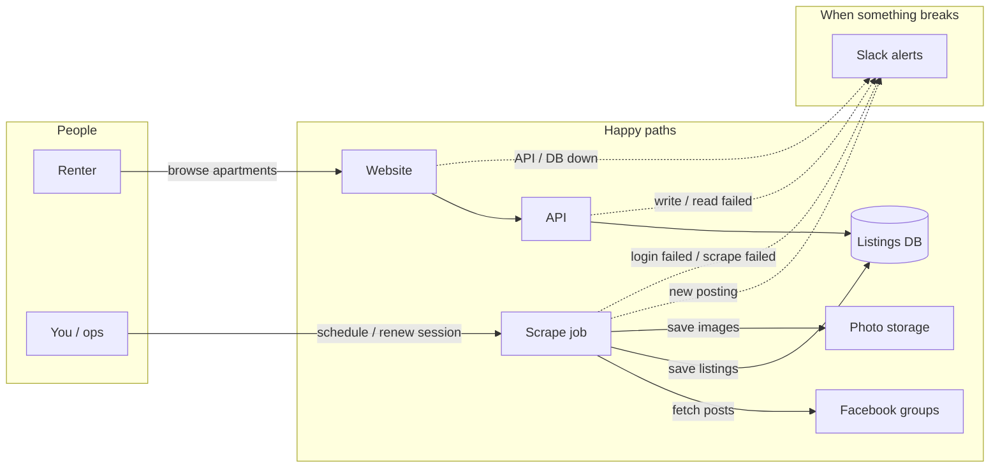

# Homie

Apartment listings from Facebook groups — scrape, store, browse.

## Flows

**Two flows**

1. **Renter** — Website → API → DB (read listings).
2. **Ingest** — Scrape job → Facebook → DB + photos (optionally notify on new posts).

**Error handling** — failures funnel to Slack: login/session, scrape, API/DB, and (later) infra/CI. Session renewal is the main ops recovery path when Facebook auth dies.
