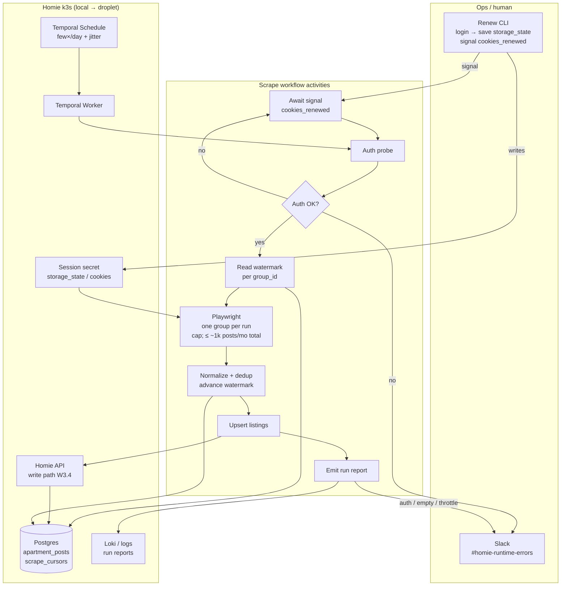

# Homie workstreams SPEC

Organizing map for what comes after local platform infra.  
Companion: [`infra/SPEC.md`](../infra/SPEC.md) (platform ownership + local proof).

**Branch:** `infra`  
**DO project:** `Homie` (`3ff485b0-8b3e-4f09-8798-079d56ecc498`, Development)

Status legend: `done` · `next` · `later` · `blocked`

---

## Stream overview

| ID | Stream | Intent | Status |
|----|--------|--------|--------|
| W0 | Platform infra (local) | k3d + monitoring + Argo CD + Argo Workflows + CI stubs | **done** |
| W1 | Slack | Workspace/channels, invite, webhooks → CI / errors / logs | next |
| W2 | DigitalOcean remote k3s | Droplet in Homie project, k3s, kubectl context | next |
| W3 | Application architecture | Python ↔ TypeScript ↔ Postgres contracts | later |
| W4 | Application setup on k3s | Workloads, env, migrate/seed (when runtime exists) | later |
| W5 | Pre-commit / drift | Hooks for lint, typecheck, infra/config drift | later |
| W6 | Make the product work | Scraper + API + UI end-to-end behavior | later |
| W6a | Facebook scrape ops | Architecture, reliability signals, session renewal (design before W6.1) | next |
| W6a-e2e | Local scrape e2e looper | `looper-homie-fb-scrape-e2e` — mocks (CI gate) + live (manual pre-prod); see W7 policy | next |
| W7 | E2E tests | Mocks automated; live Facebook e2e **manual before prod** | next |

Suggested order: **W0 → W1 ∥ W2 → W3 → W4/W5 → W6a → W6 → W7**  
(W1 and W2 can run in parallel; W3 before coding W6; **W6a before building the Facebook fetcher**.)

---

## W0 — Platform infra (local) — done

- [x] `infra/` tree, Homie-named packs, overlays, TF stub  
- [x] Cloudflare / Alchemy deploy retired on `infra`  
- [x] `k3d-homie-local` + three `install.sh`  
- [x] CI plumbing stubs (`ci-lane`, `homie-ci-smoke`, `argo-ci.yml`)  
- [x] Looper `looper-homie-infra/`  
- [ ] Operator signoff / commit (optional)

---

## W1 — Slack

**Goal:** Homie has a Slack home for ops signals (not product chat spam).

| Task | Notes | Status |
|------|-------|--------|
| W1.1 Choose workspace | Real Slack workspace **or** CLI sandbox (`slack sandbox create`). CLI cannot create a normal workspace. | next |
| W1.2 Invite collaborator | Add your friend as member | next |
| W1.3 Channels | Create at least: `#homie-ci`, `#homie-runtime-errors`, `#homie-app-logs` (align with clinic `#…-alerts-*` pattern) | next |
| W1.4 Incoming webhook / bot | Bot token or webhooks; store out-of-band (`~/.config/homie/slack.env`), never commit | next |
| W1.5 Wire Grafana | `infra/k3s/monitoring` Slack contact points → `#homie-runtime-errors` (and/or infra channel) | later |
| W1.6 Wire Argo CD | OutOfSync / SyncFailed → `#homie-ci` (see `argocd/README-slack.md`) | later |
| W1.7 Wire Argo Workflows / GHA | CI fail/success → `#homie-ci` | later |
| W1.8 App logs path | Alloy/Loki already collect container logs; decide Slack vs Grafana-only for `#homie-app-logs` | later |

**Done when:** friend can see channels; one test message hits each channel from a documented secret path.

---

## W2 — DigitalOcean remote k3s

**Goal:** Managed single-node k3s under DO project **Homie**, reachable with kubectl.

| Task | Notes | Status |
|------|-------|--------|
| W2.1 DO project | Created via `doctl` — Homie / Development | **done** |
| W2.2 Fill TF secrets | `infra/terraform/stacks/k3s` — Spaces backend, Tailscale auth key, tfvars (gitignored) | next |
| W2.3 `terraform plan/apply` | Droplet + firewall + volumes; **explicit approval** | next |
| W2.4 Assign resources to project | `doctl projects resources assign 3ff485b0-… --resource=do:droplet:…` | next |
| W2.5 Install / verify k3s | cloud-init in TF should install k3s; confirm node Ready | next |
| W2.6 kubectl context | Fetch kubeconfig (Tailscale host preferred); e.g. `~/.kube/homie-k3s.yaml`; document in `infra/README.md` | next |
| W2.7 Install platform packs on droplet | Same `install.sh` as local (maybe lite monitoring if RAM tight) | later |
| W2.8 Point Argo / CI at remote | `HOMIE_K3S_KUBECONFIG` for GHA; Argo Applications `targetRevision` | later |

**Done when:** `kubectl --context … get nodes` shows Ready remote node; platform packs optional but documented.

---

## W3 — Application interaction model

**Goal:** Decide how Python, TypeScript, and the database talk — before building scrapers/UI flows.

| Task | Notes | Status |
|------|-------|--------|
| W3.1 Data ownership | Postgres is source of truth for listings (`apartment_posts`) + watermarks (`scrape_cursors`). **Prod DB: Supabase. Staging: non-Supabase (e.g. in-cluster).** Photo blobs: **DigitalOcean Spaces**; `apartment_posts.images` stores Spaces URLs (or keys resolved via `IMAGES_BASE_URL`). No Supabase Storage. | next |
| W3.2 Scraper role | TypeScript Temporal worker (`scrapers/facebook/`) writes listings → DB (direct or via API) | next |
| W3.3 TypeScript role | API + Website read DB; Cloudflare Worker path retired — pick Node/Bun in-cluster or host | next |
| W3.4 Write path | Prefer: scrape worker → service role / internal API → DB; avoid dual schemas | next |
| W3.5 Contract doc | Short ADR: tables, who writes, who reads, auth for inserts | next |

**Done when:** one-page ADR exists; no ambiguous dual-write story.

---

## W4 — Application setup (runtime)

Depends on W3.

| Task | Notes | Status |
|------|-------|--------|
| W4.1 API runtime | Container or documented host process; env `DATABASE_URL` | later |
| W4.2 DB in/alongside cluster | In-cluster Postgres **or** Supabase remote (prod); migrate + seed | later |
| W4.2b Listing image Spaces | Create DO Spaces buckets for scraped photos: `…-staging` and `…-production` (or Homie-named equivalents); document keys out-of-band; point scraper/API at env-specific bucket + public/CDN base URL | next |
| W4.3 Kustomize base | `infra/k3s/base/` Deployments/Services when ready | later |
| W4.4 Local overlay | `overlays/local` wires images + secrets examples | later |

---

## W5 — Pre-commit / drift

| Task | Notes | Status |
|------|-------|--------|
| W5.1 Choose hook runner | **Husky 9** via root `prepare` + `.husky/pre-commit` | **done** (bootstrap) |
| W5.2 Fast checks | format, typecheck on staged TS | later |
| W5.3 Drift checks | `infra/` Homie-named invariants (reuse `looper-homie-infra/scripts/check-*.py`); generated env/config sync if added | later |
| W5.4 Skip rules | docs-only / markdown-only paths don’t run heavy gates | later |

**Done when:** a bad rename (`clinic-*` residue) or broken SPEC heading fails locally before push.

### W5 — When do we run DB migrations? (open)

**Decision needed** — migrations are **not** in the Husky pre-commit hook (dropped on purpose: needs live Postgres, slow/noisy for docs/infra commits, surprising in worktrees).

Keep using:

```bash
bun run db:migrate    # drizzle-kit migrate via DIRECT_URL
bun run db:generate   # after schema edits
```

Optional helper still in tree: `scripts/db-migrate-precommit.sh` / `bun run db:migrate:precommit` (opt-in only; not wired to Husky).

Discuss and pick one (or a combo) for Homie:

| Option | When migrate runs | Pros | Cons |
|--------|-------------------|------|------|
| **A. Explicit only** | Dev runs `db:migrate` after pull / after `db:generate` | Simple, no env coupling | Easy to forget; local DB drifts |
| **B. Pre-push / CI** | Hook or GHA before tests | Catches drift before remote | Still needs DB in that environment |
| **C. E2E / test setup** | Migrate at start of e2e (or testcontainer) | Tests always see current schema | Unit tests may still assume migrated DB |
| **D. App boot** | API/worker migrates on startup (local/staging only) | Always fresh against that env | Risky in prod; lock/contention |
| **E. Pre-commit (rejected for default)** | On every commit / when schema staged | Forces sync | Blocked without DB; bad for parallel/docs commits |

**Lean (to confirm):** **A + C** — explicit migrate in the normal edit loop; CI/e2e always migrate (or start from migrated image) before suites. Add a **check-only** pre-commit later: “schema.ts changed but no new `drizzle/*.sql`” without applying SQL.

**Record the choice here** when decided: `_undecided — 2026-07-18_`.

---

## W6a — Facebook scrape ops (design)

**Goal:** Decide how low-intensity Facebook group scrapes run, how we detect unreliability, and how we renew sessions — *before* building W6.1.

**Context:** Groups have no usable public API. Scrapers are structurally flaky (DOM/GraphQL churn, login walls, soft bans). Homie only needs **low intensity** (a few runs/day, few groups, recent posts). That reduces ban risk; it does **not** remove breakage or session expiry. Treat unreliability as a first-class ops problem.

**Depends on:** W1 (Slack channels for signals), W3 (write path into DB/API).  
**Blocks:** W6.1 implementation details.

### W6a.1 — Architecture (talk through)

**Lean (2026-07-18):** **self-hosted Playwright + saved Facebook session** for **members-only** groups. Public-only hosted scrapers dropped (no login/cookies). Volume target: **≤1,000 posts/month across 3 groups**. **Orchestration: Temporal** (operator familiarity) — not Argo CronWorkflow for this path. Argo Workflows stays for CI/platform (W0); Temporal owns scrape schedules, cookie wait/signal, and retries.

Low-intensity shape to confirm:

```
Temporal Schedule (few×/day, jitter)
  → scrape workflow
      → auth probe; on auth fail: Slack + await signal("cookies_renewed") (or pause schedule)
      → read per-group watermark from Postgres (post_id / date_posted)
      → Playwright activity (saved storage_state / cookies) — **one group per workflow run**
      → scroll recent posts for that group (hard cap; total ≤ ~1k posts/mo across groups)
      → normalize + dedup (post id/url); advance watermark
      → write path (W3.4: internal API or service role → apartment_posts)
      → emit run report (structured log + optional Slack)
```



k3s connection: Temporal server + worker Deployment(s) on Homie cluster (local k3d first, droplet later with W2/W4). Session file/secret out-of-band (`~/.config/homie/` or K8s Secret). Monitoring/Slack still via W1 + existing Loki path. Argo Workflows remains for CI only (not shown).

**Auth probe (scaffolded):** `scrapers/facebook/` (TypeScript) — activity `probeFacebookAuth` → on failure posts to `#homie-runtime-errors` (`SLACK_RUNTIME_ERRORS_CHANNEL_ID`) and workflow awaits signal `cookies_renewed`.

Optional later: Apify cookie-capable actor if we want to outsource selector maintenance (still needs our session).

| Decision | Options / lean | Status |
|----------|----------------|--------|
| Provider | **Self-host Playwright**; Apify+cookies optional later; no public-only hosted API | **agreed** |
| Orchestration | **Temporal** (schedules + cookie wait/signal); Argo stays for CI | **agreed** |
| Runtime | Playwright + saved browser state (member account); **auth probe activity** before scrape | **agreed** |
| Volume | ≤1,000 posts/mo total; 3 groups; cap per run | **agreed** |
| Scope | Members-only groups the session account has joined | **agreed** |
| Watermark | Postgres per-group cursor (`scrape_cursors`); Homie-owned | **agreed** |
| Schedule | **One Temporal workflow per group** (distinct runs; failure isolation); few×/day + jitter | **agreed** |
| Host | Temporal + worker on k3s (local first); secrets out-of-band | next |
| Language | **TypeScript** Temporal worker + Playwright (`scrapers/facebook/`) | **agreed** |
| Listing images | Download in scrape → upload **DO Spaces** → persist **Spaces URLs** in `apartment_posts.images` (`text[]`); staging/prod = separate buckets via config | **agreed** |
| Image storage (DO) | Provision **two dedicated Spaces buckets** for scraped post photos: one **staging**, one **production**; wire via env (`IMAGES_BUCKET` / `IMAGES_BASE_URL`), never share buckets across envs | **next** |

**Drizzle schema — `scrape_cursors`** (defined in `Homie-Website/src/db/schema.ts`; migration `drizzle/0001_scrape_cursors.sql`):

One row per Facebook group. Watermark = how far Homie has successfully ingested; advance only after a successful upsert batch for that group.

| Column | Notes |
|--------|--------|
| `source` + `group_id` | Unique; `source` default `facebook_group` |
| `group_url` | Canonical group URL |
| `last_post_id` / `last_posted_at` | Watermark (null until first successful ingest) |
| `last_run_at` / `last_status` / `last_error` | Ops signal (`ScrapeCursorStatus` enum) |
| `posts_seen` / `posts_new` | Last-run counters |

**Usage:** workflow reads row by `(source, group_id)` → scrape → upsert `apartment_posts` by post `url`/`post_id` → on success set `last_post_id` / `last_posted_at` to the newest ingested post and `last_status = 'ok'`. On auth/parse/throttle failure: update `last_status` / `last_error` / `last_run_at` **without** moving the watermark.

### Playwright single-run contract

Code mirror: `scrapers/facebook/src/scrapeRunPolicy.ts`.

**One run = one group** (after auth probe OK):

1. Load `scrape_cursors` for `(facebook_group, group_id)`.
2. Open group URL with saved storage_state (chronological sort if available).
3. Scroll the feed; parse visible posts (`post_id`, url, text, `date_posted`, author).
4. Decide which posts are **candidates** (see cold start vs incremental below).
5. Upsert candidates → Homie write path; dedupe by post url / `post_id`.
6. On success: advance watermark to the **newest** successfully ingested post; set `last_status=ok`, counters.
7. Emit run report (`posts_seen`, `posts_new`, `posts_upserted`, stop reason).

**When to stop scrolling** (first match wins):

| Condition | Stop reason |
|-----------|-------------|
| Collected `maxPostsPerRun` posts (default **40**) | `hit_post_cap` |
| Incremental run: hit a post with `post_id == last_post_id` (or older than `last_posted_at` with enough continuity) | `hit_watermark` |
| Cold start: collected `coldStartMaxPosts` (default **30**) | `cold_start_cap` |
| `maxScrolls` reached (default **25**) with no new unique posts | `scroll_exhausted` |
| `maxDurationMs` exceeded (default **3m**) | `timeout` |
| Login wall / checkpoint mid-run | `auth` (no watermark move; Slack) |
| Zero parseable posts after scrolls | `empty_suspect` (no watermark move; Slack if repeated) |

**No existing `scrape_cursors` row (cold start):**

- Do **not** scrape the whole history.
- Create the cursor row at run start (or first success) with `last_status` in progress / after run.
- Backfill only the **most recent** `coldStartMaxPosts` (≤30) posts.
- After successful upserts: set `last_post_id` / `last_posted_at` to the newest of those; subsequent runs are incremental (`hit_watermark`).
- If the feed is empty on cold start → `empty_suspect`, leave watermark null, do not pretend success.

**Incremental run (cursor exists with watermark):**

- Collect posts newer than watermark until `hit_watermark` or caps.
- Posts ≤ watermark are ignored (already seen).
- If we never reach the watermark but hit `maxPostsPerRun`, still advance watermark to the newest ingested this run (gap risk noted in run report as `possible_gap`).

| Decision | Lean | Status |
|----------|------|--------|
| Cold start | Backfill recent N only (`coldStartMaxPosts=30`), then watermark | **leaning** |
| Stop rules | Caps + watermark + timeout as table above | **leaning** |
| Policy file | `scrapeRunPolicy.ts` | **agreed** |

**Open questions:** shared vs personal FB account; keyword filters (scraper vs post-DB); Homie-alerts in-path or side-path; whether `apartment_posts.url` is enough for dedup or we need a `source_post_id` column.

**Done when:** short ADR or bullet contract: schedule → scrape → dedup/watermark → write → report (+ cookie signal path).

### W6a.2 — Error / reliability logging (talk through)

Because results are flaky, every run must answer: *did it work, and if not, why?*

| Signal | Why | Where |
|--------|-----|--------|
| Run started / finished | Baseline liveness | structured logs |
| `posts_seen`, `posts_new`, `posts_upserted` | Empty feed vs real quiet day | structured logs + metrics |
| `zero_results` / `below_baseline` | Likely breakage (selectors, login wall) | `#homie-runtime-errors` (W1) |
| Session / auth class | expired cookie, checkpoint, login interstitial | tagged error + Slack |
| Parse class | selector miss, GraphQL shape change, truncated text rate | tagged error |
| Throttle / challenge class | captcha, rate limit, soft ban | tagged error + Slack |
| Duration / scroll depth | hung scroll or early stop | logs |
| Artifact on failure | screenshot + HTML/network sample (gitignored / object storage) | attach or link from alert |

| Task | Notes | Status |
|------|-------|--------|
| W6a.2.1 Error taxonomy | Enumerate exit reasons (ok / empty_suspect / auth / parse / throttle / crash) | next |
| W6a.2.2 Structured run report | One JSON object per run; always emit even on success | next |
| W6a.2.3 Alert thresholds | e.g. 0 new posts N runs in a row, or auth failure → Slack immediately | next |
| W6a.2.4 Wire Slack | Auth probe → `#homie-runtime-errors` via `formatRuntimeErrorMessage` / `formatAuthFailureMessage` | **done** (template + probe) |
| W6a.2.5 Failure artifacts | Screenshot + optional response dump on non-ok; retention policy | later |

**Done when:** a broken selector or dead session produces a clear, classed alert — not silent empty inserts.

### W6a.3 — Session cookie renewal (talk through)

Sessions die. Renewal must be **comfortable** (minutes, not a scavenger hunt), because low intensity still needs a live login every few days/weeks.

| Approach | Comfort | Notes |
|----------|---------|--------|
| A. Headed one-shot `login_and_save_state` | High for solo | Open browser, log in manually, write `storage_state.json` out-of-band |
| B. Cookie paste path | Medium | Export cookies from browser extension → drop file into `~/.config/homie/` | 
| C. Alert → renew CLI | High | Auth-class failure Slack → `homie fb-login` (or script) documented in one place |
| D. Fully automated login | Low / fragile | Avoid: 2FA, checkpoints, ToS risk |

**Lean:** A + C — manual headed login that writes a known path; Slack on auth failure with the renew command; renew CLI also **signals Temporal** `cookies_renewed` (or unpauses the schedule) so parked workflows resume.

| Task | Notes | Status |
|------|-------|--------|
| W6a.3.1 Secret location | e.g. `~/.config/homie/facebook_state.json` (never commit); document env override | next |
| W6a.3.2 Renew UX | One command / short script: open headed browser → save state → verify group URL loads | next |
| W6a.3.3 Auth health check | Cheap pre-scrape or post-fail probe: am I logged in? | next |
| W6a.3.4 Slack copy | Auth alert includes renew steps / command | later |
| W6a.3.5 Rotation ops | Who owns the FB account; what happens if checkpoint requires phone | next |

**Done when:** renewing a dead session is a documented <5-minute path, and auth failure tells you to do it.

### W6a — Done when (stream)

- Architecture bullets agreed (W6a.1)  
- Error taxonomy + run report shape agreed (W6a.2)  
- Session path + renew command agreed (W6a.3)  
- Then implement under W6.1 with those contracts

---

## W6 — Make the code work

Depends on W3–W4 and **W6a** (for Facebook fetcher design).

| Task | Notes | Status |
|------|-------|--------|
| W6.1 Facebook (or other) fetcher | Scaffold: `scrapers/facebook/` (TS Temporal auth probe + Slack); scrape/upsert TBD per W6a | later |
| W6.2 Persist listings | Insert/upsert into `apartment_posts` | later |
| W6.3 API list/read | TypeScript serves active listings | later |
| W6.4 UI | Homie-Website shows listings from API | later |

---

## W7 — E2E tests

Depends on W6 / W6a scrape path. Two scrape e2e kinds:

| Kind | Command | When | Slack |
|------|---------|------|--------|
| **Mocks** | `cd scrapers/facebook && bun run check:e2e-mocks` | Automated gate — every PR / staging CI / pre-push that touches scrape | Never (unit-test formatter / recorder only) |
| **Live** | `cd scrapers/facebook && bun run preprod:e2e-online` (wraps `check:e2e-online`) | **Manual only** — operator runs before promoting scrape to **prod** (and when debugging session/FB path) | Do not treat as `#homie-runtime-errors` by default; opt-in later if needed |

**Agreed policy**
- Staging CI runs **mocks**, not live Facebook.
- Live is **not** a blocking staging Workflow on every deploy.
- Before prod scrape rollout: operator activates live e2e locally (fresh session → green → promote).
- Optional later: scheduled/manual staging Cron for session health — still separate from the default CI gate.

| Task | Notes | Status |
|------|-------|--------|
| W7.0 Scrape e2e policy | Mocks = CI gate; live = manual pre-prod (`runE2eOnline.ts`) | **done** |
| W7.1 Live run script | `scrapers/facebook/scripts/runE2eOnline.ts` → `bun run preprod:e2e-online` | **done** |
| W7.2 Mocks in CI | Wire `check:e2e-mocks` into Argo / GHA when scrape CI lands | later |
| W7.3 Product e2e | Seed → API → UI (broader Homie, beyond FB scrape) | later |
| W7.4 Slack on CI fail | Platform/CI failures → `#homie-ci` / `#homie-alerts-argo-workflows` (W1) | later |

---

## Explicit non-goals (until a stream owns them)

- Restoring Alchemy/Cloudflare deploy as the primary path  
- Sharing clinic’s Slack workspace / DO droplet as Homie’s home  
- Committing Slack tokens, kubeconfigs, or `secrets.auto.tfvars`

---

## How to use this doc

1. Pick one stream (usually W1 or W2 next).  
2. Tick tasks in-place or spawn a looper for that stream.  
3. When a stream completes, note date under its **Done when** and link any ADR/PR.
